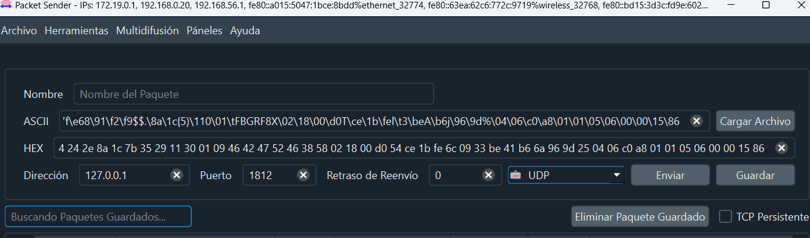

# Server Simulator Radius

Esto va a ser un servidor de simulación de Radius, que va a recibir un hexadecimal con el formate que acepta radius y lo va a validar si esta en la base de datos ese hexadecimal.

Para probar esto, se puede utilizar packet sender.
con la ip localhost y el puerto 1812 y un paquete UDP.
luego en el campo de texto se pone el hexadecimal que se quiere enviar (hexa completo a enviar) de cada uno de los usuarios de prueba, solo estan estos 3 en la db de prueba.

## Hexadecimales de Prueba
Estos hexadecimales de prueba se crean con una aplicacion (hexaconverter). Esta aplicaciion recibe 
un id (username), un pin y token (pin + token = password) y algunos datos de configuraciones y con todo esto arma el paquete en hexa para enviar.
A continuacion se detalla que tiene cada prueba solo con fin de informar ya q solo se tiene que tener en cuenta el hexadecimal completo a enviar.
- HEXA-6X : nombre de la key en userDatabase
- userName : nombre de usuario con su valor original y entre parentesis el valor en hexa
- User-Password : password con su valor original y entre parentesis el valor en hexa
- hexa completo a enviar : es el paquete completo en hexadecimal que se debe enviar para que el servidor lo valide.

-------------

HEXA-6X ------>

userName = FBGRF6X (46424752463658)

User-Password  = 4321987654321 (a2 c8 87 b7 3d 5a 61 07 e6 38 f8 5b 0b 80 3c ee)

hexa completo a eviar:

01 00 00 3b 7f e6 38 91 f2 f9 24 24 2e 8a 1c 7b 35 29 11 30 01 09 46 42 47 52 46 36 58 02 18 a2 c8 87 b7 3d 5a 61 07 e6 38 f8 5b 0b 80 3c ee 04 06 c0 a8 01 01 05 06 00 00 15 86

-------------

HEXA-7X ------>

userName = FBGRF7X (46424752463758)

User-Password = 2341987654321 (37 35 95 d0 b7 d9 8d 19 38 08 ae 30 ef 17 8d 36)

hexa completo a eviar:

01 00 00 3b 7f e6 38 91 f2 f9 24 24 2e 8a 1c 7b 35 29 11 30 01 09 46 42 47 52 46 37 58 02 18 37 35 95 d0 b7 d9 8d 19 38 08 ae 30 ef 17 8d 36 04 06 c0 a8 01 01 05 06 00 00 15 86

------------

HEXA-8X ------>

userName = FBGRF8X (46424752463858)

User-Password  = 1234987654321 (00 d0 54 ce 1b fe 6c 09 33 be 41 b6 6a 96 9d 25)

hexa completo a eviar:

01 00 00 3b 7f e6 38 91 f2 f9 24 24 2e 8a 1c 7b 35 29 11 30 01 09 46 42 47 52 46 38 58 02 18 00 d0 54 ce 1b fe 6c 09 33 be 41 b6 6a 96 9d 25 04 06 c0 a8 01 01 05 06 00 00 15 86